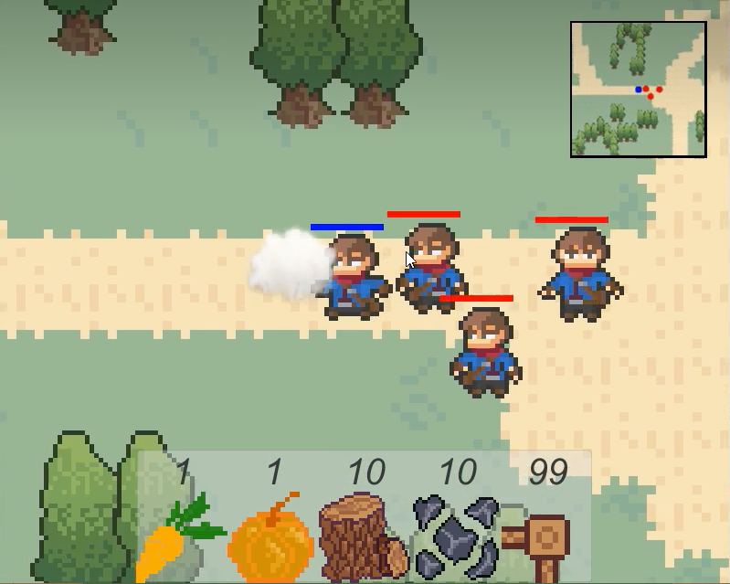

# tcp-framework
#### 快速开始
1. 创建server服务实例
2. 配置自定义路由及业务
3. 启动服务

```golang
package main

import (
	"fmt"
	"mmo/ginm/pkg/utils"
	"mmo/ginm/source/inter"
	"mmo/ginm/source/mnet"
	"time"
)
type pingRouter struct {
	mnet.BaseRouter
}
func (r *pingRouter) Handler(request inter.Request) {
	data := append(request.GetMessage().GetData(), utils.StringtoSlice("Handler\n")...)
	if err := request.GetConn().Send(request.GetMessage().GetMsgType(), data); err != nil {
		fmt.Println("Handler error:", err.Error())
		return
	}
}

func main() {
	tcpServer := mnet.NewServer()
	tcpServer.AddRouter(1, &pingRouter{})
	tcpServer.Serve()
}
 ```
### 其他功能
1.路由，路由跳转及路由组

2.中间件

3.消息异步处理及异步回调

4.支持Kcp（基于UDP可靠性快速传输协议)

5.数据报文拦截器

6.自定义数据报文解码

7.日志组件
### 示例程序
为了验证tcp框架的可用性。使用此框架，完成了一个简单的2d像素小游戏。

1.玩家上线下线提醒。

2.玩家位置同步。

3.玩家攻击，死亡等状态同步

#### 运行服务端
```
go run ,/example/main.go
```

#### 游戏玩法
wasd-玩家移动，空格-攻击，shift-加速





